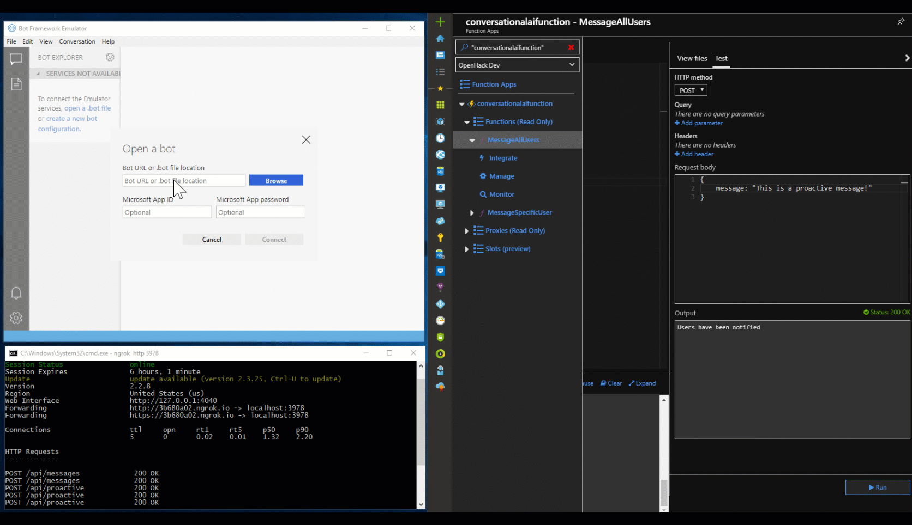
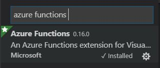
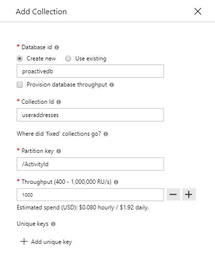
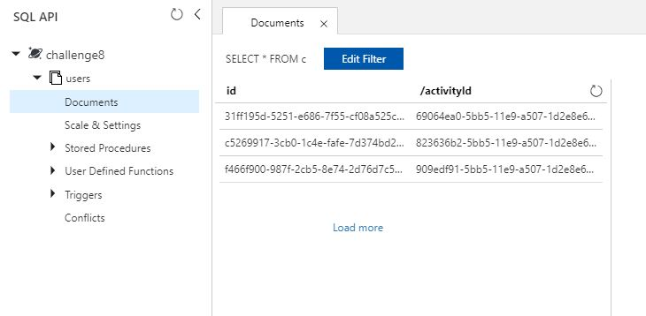
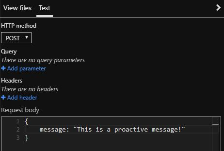

# Proactive Messaging in Node Bot Framework v4 SDK

This sub repository contains code sample and instructions which demonstrate basic and advanced implementation of proactive messaging in Node.

1. [Basic Implementation](#basic)
2. [Advanced Implementation](#advanced)

<a name="basic"></a>
# Basic Implementation

At its most basic level, sending proactive messages requires a few additions to a botbuilder SDK bot:

- A separate endpoint on the bot that uses a conversation reference to message the user outside the scope of the bot's onTurn handler
- A mechanism to store a conversation reference for the user
- A mechanism to retrieve the stored conversation reference and invoke the proactive message endpoint

***The bot project inside the /node/basic-sample directory fully implements the following instructions.***

### Running the Basic Sample

Navigate to ```/basic-sample/bot/``` and create a .env file with the following contents:

```
microsoftAppID=""
microsoftAppPassword=""
```

The .env file replaces the use of the .bot file, [which is now deprecated](https://docs.microsoft.com/en-us/azure/bot-service/bot-file-basics?view=azure-bot-service-4.0&tabs=js):

> Prior to the Bot Framework SDK 4.3 release, we offered the .bot file as a mechanism to manage resources. However, going forward we recommend that you use appsettings.json or .env file for managing these resources. Bots that use .bot file will continue to work for now even though the .bot file has been ***deprecated***. If you've been using a .bot file to manage resources, follow the steps that apply to migrate the settings.

In the same directory, run ```npm install``` and then ```npm run start```.

### Testing the Bot

Now that the bot is running, test it using the [Bot Framework Emulator](https://github.com/Microsoft/BotFramework-Emulator/releases/tag/v4.3.3):

* In the "Welcome" tab, click "Open Bot"
* Under "Bot URL or .bot file location," add the endpoint URL "http://localhost:3978/api/messages"
* Click "Connect"

Chat with the bot in the emulator. To initialize a proactive message, send the bot text that begins with "proactive - " and be careful to note that spacing matters.

## How the Basic Sample Works

The basic sample works by implementing a proactive endpoint, saving conversation reference and posting against the endpoint using the saved conversation reference. Effectively, the bot is telling itself to send a proactive message. Real-world applications of proactive messaging would instead involve an external service (e.g. Azure Functions) that would "tell" the bot to send some proactive messages. See advanced sample for an example that does this. 

### Implementing the Proactive Endpoint

As discussed in the top-level README of this wiki, we are exposing an additional endpoint (/api/proactive) to receive commands to send proactive messages. This endpoint lives on the same server as our bot's endpoint (api/messages), and uses the bot adapter to proactively reach out to users. We're able to do this by using the ```continueConversation()``` method on the BotFrameworkAdapter class. ```continueConversation()``` accepts an instance of the ConversationReference class, so requests to the endpoint must contain a stored instance of a conversation reference object.

The following code has been added to the index.js file, which creates an /api/proactive endpoint that expects a request body containing a conversation reference and message:

```javascript
server.post('/api/proactive', async (req, res) => {
    let reference = req.body.reference;
    let message = req.body.message;
    await adapter.continueConversation(reference, async (turnContext) => {
        await turnContext.sendActivity(message);
    });
});
```

In order for the restify server to handle request body objects, the server must use body parser middleware. Add the following code to the index.js file after the server creation logic:

```javascript
// add body parser
server.use(restify.plugins.bodyParser());
```

### Storing the Conversation Reference

Conversation references can be retrieved during any conversation turn using the turnContext object. The TurnContext class contains a ```getConversationReference()``` method, which accepts an instance of the Activity class, accessible on any turnContext instance.

For the basic implementation, the reference is stored in memory on runtime as conversation state. Instantiate conversation state in the index.js file and pass it into the bot's constructor:

```javascript
// Introduce state
const memoryStorage = new MemoryStorage();
const conversationState = new ConversationState(memoryStorage);
const myBot = new MyBot(conversationState);
```

Ensure that the bot's constructor accepts the conversation state and creates a property that will be used to later store the user's conversation reference:

```javascript
constructor(conversationState) {
    this.conversationState = conversationState;
    this.conversationReference = this.conversationState.createProperty('CONVERSATION_REFERENCE');
}
```

The following method takes the turnContext from a conversation turn, pulls the conversation reference using the ```getConversationReference()``` method, and stores it in the conversation state property created in the constructor. Add the method to your bot class:

```javascript
async storeConversationReference(turnContext) {
    // pull the reference
    const reference = TurnContext.getConversationReference(turnContext.activity);
    // store reference in memory using conversation data property
    await this.conversationReference.set(turnContext, reference);
}
```

Call the method in your bot's onTurn handler, preferably immediately when the bot receives a conversationUpdate activity:

```javascript
// store the conversation reference for the newly added user
await this.storeConversationReference(turnContext);
```

Make sure to save the conversation state after the method call:

```javascript
// save the conversation state
await this.conversationState.saveChanges(turnContext);
```

### Posting the Stored Conversation Reference to the Proactive Endpoint

The /api/proactive endpoint can be hit by any service, so long as it sends a conversation reference and message in the request body. For the basic sample, the endpoint is configured to be hit by the bot itself. To complete the flow, you'll need to retrieve the stored conversation reference and make a post request against the /api/proactive endpoint with a body containing the reference and the message to send. The following method demonstrates this functionality:

```javascript
async triggerProactiveMessage(turnContext, message) {
    // pull the reference
    const reference = await this.conversationReference.get(turnContext);
    const postBody = { reference, message };
    const localProactiveEndpoint = 'http://localhost:3978/api/proactive';
    await turnContext.sendActivity('Proactive message incoming...');
    // send the conversation reference and message to the bot's proactive endpoint
    await fetch(localProactiveEndpoint, {
        method: 'POST',
        body: JSON.stringify(postBody),
        headers: { 'Content-Type': 'application/json' }
    });
}
```

The above method uses the fetch npm package to make the post request, but any http client could be used in its place. Call the method from anywhere in your bot's onTurn handler and the bot will send a proactive message. In the basic implementation, the bot is configured to echo user messages unless the user sends a message that begins with "proactive - ", in which case it triggers the method:

```javascript
if (turnContext.activity.text.includes('proactive - ')) {
    // if user types proactive - {message}, send the message proactively
    const message = turnContext.activity.text.split('proactive - ')[1];
    await this.triggerProactiveMessage(turnContext, message);
} else {
    // otherwise, echo text back to user
    await turnContext.sendActivity(`You said '${turnContext.activity.text}'`);
}
```

<a name="advanced"></a>
# Advanced Implementation

## Running the Advanced Sample



### Download Dependencies

1. Download the Azure Functions core tools npm package: `npm azure-functions-core-tools -g`.
2. Navigate to the `node/advanced-sample` directory
3. Navigate into the `bot` project and run `npm i`
4. Navigate into the `azureFunction` project and run `npm i`
5. While in the Azure Functions project, download the CosmosDB functions binding: `"func extensions install --package Microsoft.Azure.WebJobs.Extensions.CosmosDB --version 3.0.0"`
6. If using VS Code, download the Azure Functions Extension from the marketplace:
    
7. Download [ngrok](https://ngrok.com/) to allow us to run our bot locally and test it in public

### Create a Cosmos DB Database

1. Open the Azure portal and click the plus sign to create a new resource
2. Search for Cosmos DB and click create
3. Specify the Subscription, Account Name and Location in which you'd like to deploy your database. Leave other fields untouched. 
4. Navigate through menus and click "Create"
5. Once your Cosmos account has been created, Click add collection
6. Create new database, collection and Partition Key (see example):
    
7. Click the "Keys" icon and make note of your URI, Primary Key and Primary Connection String (these will be used in the next step)

### Running your Bot
For the sake of demonstration, we'll run our bot locally.

1. Navigate to your bot directory
2. Update your `cosmos-config.json` with your Cosmos configuration
3. Run your bot using `npm run start`. It will run on `http://localhost:3978/api/messages`
4. Configure ngrok to create a public endpoint that points to your local endpoint: `ngrok http 3978`
5. Test your bot using the Bot Framework Emulator
    - Click File -> Open Bot
    - Enter your ngrok url + /api/message (e.g. "http://3b680a02.ngrok.io/api/messages")
    - Send your bot a message, validating that it echoes a response
6. Validate that your Cosmos DB is persisting user addresses:
    - Navigate to your Cosmos Account in the Azure portal and open "Data Explorer"
    - Open your collection, click documents and observe the user address(es) that the bot persisted:
    

### Create Azure Function

Now we need to deploy our Azure Function, which will query our Cosmos instance and post against our bot's proactive endpoint to tell it to send proactive messages.

1. Open Azure Icon in VS Code Activity Bar and authenticate against your Azure Subscription. **Note**: This icon should have been added after downloading the Azure Functions extension. If you don't see it, restart VS Code. 
2. In the Functions Menu, navigate to the subscription in which you want to deploy your function
3. Click the directory icon to create a new Functions project
4. Navigate back to the `advanced-sample`
5. For each function (`MessageAllUsers` and `MessageSpecificUser`) update the `function.json` files with the appropriate `databaseName` and `collectionName`:
    ```js
        "databaseName": "proactivedb",
        "collectionName": "useraddresses",
    ```
6. Right click the `azureFunction` directory, then click "Deploy to Function App"
7. Open your Function in the Azure portal
8. Click the application settings link
9. Add two new application settings: `AzureWebJobsDocumentDBConnectionString` and `ProactiveEndpoint` with your Cosmos connection string and ngrok endpoint respectively. **Note**: These keys can also be seen in the function's `local.settings.json`. To test your function locally, you'd want to add the right values here as well. 
10. Open the `MessageAllUsers` function and open the test panel on the right side
11. Create a POST request against your function, with a JSON request body with a `message` property:
    
12. Click Run and observe your bot sending a proactive message!


## How the Advanced Sample Works

In a real-world implementaion, the goal is to trigger the proactive message outside of the bot. Effectively, an external service (e.g. a flight booking notification system) should be able to trigger the bot to send users an update (e.g. "We've found a flight that may be interesting to you!"). Triggering the /api/proactive endpoint created from earlier can be achieved through via an external web service, eventing mechanism, or a simple REST call.

In this example, the service architecture is capable of sending notifications to specific users as well as broadcasting to the entire subset of users that have interacted with the bot. In order to implement this flow, a few things were added:

- An updated proactive endpoint capable of broadcasting
- A database to store conversation references (CosmosDB)
- An Azure Function capable of retrieving conversation references from the database and posting to the proactive endpoint

The bot will be configured to store conversation references in Cosmos DB and handle proactive messages to multiple conversations via POST requests. The Azure Function will be configured to retrieve the conversation references for all users or a single user and post them to the bot's proactive endpoint. The function can then be used by any external service to trigger proactive messages to users. The full flow is as follows:

1. The bot stores the conversation reference in Cosmos DB when a user starts a conversation with the bot on a new channel.
2. The Azure Function accepts a request with a body containing a message property.
3. The Azure Function retrieves a subset of the conversation references stored in CosmosDB and posts the references and message to the bot's proactive endpoint.
4. The bot proactively messages each conversation for which references were sent.

It is important to note that any services could be used as alternatives to CosmosDB for storage and Azure Functions for endpoint triggering.

***The bot and azureFunction projects inside the /node/advanced-sample directory fully implement the following instructions.***

### Create the Proactive Endpoint

Broadcasting will require handling of multiple conversation references, and messaging a user could involve several conversation references as well. A user may chat with the bot on multiple channels and could thus have multiple conversation references attached to their user id. The proactive endpoint will continue to use the ```continueConversation()``` method on the BotFrameworkAdapter class, but will need to be updated in order to handle the array of conversation references the Azure Function will ultimately post to it.

The following code should be added to the index.js file, which creates an /api/proactive endpoint that expects a request body containing an array of conversation references and message, ultimately sending proactive messages to all references sent in the body:

```javascript
server.post('/api/proactive', async (req, res) => {
    let references = req.body.references;
    let message = req.body.message;
    for (let reference of references) {
        await adapter.continueConversation(reference, async (turnContext) => {
            await turnContext.sendActivity(message);
        });
    }
});
```

### Store the Conversation Reference using Cosmos DB

For this advanced implementation, the reference is stored in a Cosmos DB SQL API. Before implementing code to interact with Cosmos DB, provision a new empty Cosmos DB instance on Azure with the Core(SQL) API using the [Microsoft Docs](https://docs.microsoft.com/en-us/azure/cosmos-db/create-sql-api-nodejs#create-a-database-account)

Open `cosmos-config.json` and replce the placeholder properties with those from your Cosmos DB instance:

```javascript
{
    "SERVICE_ENDPOINT": "https://YOUR-ENDPOINT-NAME.documents.azure.com:443/",
    "AUTH_KEY": "YOUR-SECRET",
    "DATABASE": "DATABASE-NAME",
    "COLLECTION": "COLLECTION-NAME"
}
```

Make sure to npm install the @azure/cosmos package and require it, along with the cosmos-config file, in your bot.js file:

```javascript
const config = require('./cosmos-config');
const CosmosClient = require('@azure/cosmos').CosmosClient;
```

Next, create a method that will connect to your Cosmos DB instance and return a useable client for later database operations. Create a class property called ```cosmosClient``` and assign it to the client returned from your newly created method in the bot's constructor:

```javascript
constructor() {
    this.cosmosClient = this.createCosmosClient();
}

createCosmosClient() {
    const masterKey = config.AUTH_KEY;
    const endpoint = config.SERVICE_ENDPOINT;
    const cosmosClient = new CosmosClient({ endpoint: endpoint, auth: { masterKey: masterKey } });
    return cosmosClient;
}
```

The following method takes the turnContext from a conversation turn, pulls the conversation reference using the ```getConversationReference()``` method, and utilizes the ```cosmosClient``` class property initialized earlier to store it in the database and collection specified in the cosmos-config.json file. Add the method to your bot class:

```javascript
async storeConversationReference(turnContext) {
    // pull the reference
    const reference = TurnContext.getConversationReference(turnContext.activity);
    // store reference in cosmosDB
    try {
        await this.cosmosClient.database(config.DATABASE).container(config.COLLECTION).items.create(reference);
    } catch (err) {
        turnContext.sendActivity(`Write failed: ${err}`);
        console.log(err);
    }
}
```

Much like the basic example, call the method in your bot's onTurn handler, preferably immediately when the bot receives a conversationUpdate activity:

```javascript
// store the conversation reference for the newly added user
await this.storeConversationReference(turnContext);
```

### Retrieve Cosmos DB data using the Azure Function

Azure Functions are able to connect to a number of other Azure services through bindings. Interaction with the Cosmos DB via the Azure Function will be achieved through the addition of the CosmosDB input binding. For more information on bindings, visit the [Microsoft Docs](https://docs.microsoft.com/en-us/azure/azure-functions/functions-triggers-bindings)

Install the Azure Functions Core Tools npm package to take action on the function app via the CLI

```npm install -g azure-functions-core-tools```

Create a new local Azure Function app, and add 2 HTTP triggered functions to it called 'MessageAllUsers' and 'MessageSpecificUser'. For instructions on developing local functions, visit the [Microsoft Docs](https://docs.microsoft.com/en-us/azure/azure-functions/functions-develop-local)

In order to use the CosmosDB input binding, navigate into your function app's folder and install the extension:

```func extensions install -p Microsoft.Azure.WebJobs.Extensions.CosmosDB -v 3.0.0```

Before you can create the binding, the function must have access to its connection string via an environment variable. Add the following environment variable to the ```Values``` section of the local.settings.json file.

```"AzureWebJobsDocumentDBConnectionString": "YOUR_COSMOS_CONNECTION_STRING"```

Each function should have generated a function.json file that contains configuration metadata, including binding configurations. The following code will create a binding that utilizes the connection string environment variable to assign the results of the ```sqlQuery``` to a variable called ```allDocuments```. Add it to the functions.json file in the 'MessageAllUsers' function:

```javascript
{
    "name": "allDocuments",
    "type": "cosmosDB",
    "direction": "in",
    "databaseName": "YOUR_DATABASE",
    "collectionName": "YOUR_COLLECTION",
    "sqlQuery": "SELECT * FROM c",
    "connectionStringSetting": "AzureWebJobsDocumentDBConnectionString"
}
```

The 'MessageSpecificUser' function requires the same addition with a different ```sqlQuery``` value and can use a different name, though that is entirely up to the developer. The /node/advanced-sample/azureFunction/MessageSpecificUser/function.json file demonstrates creation of the binding that retrieves conversation references for a specific user.

Using the binding in the function code is quite simple. Each function has access to an object called ```context``` that contains its bindings, accessible through ```context.bindings```. The binding name specified in the function.json file becomes a key on the ```context.bindings``` object, so in this case, ```context.bindings.allDocuments``` contains the results of the ```sqlQuery``` value. Add the following code to the 'MessageAllUsers' index.js file to retrieve all conversation references:

```javascript
// pull all cosmos entries, each of which is a conversation reference
let conversationReferences = context.bindings.allDocuments;
```

### Post the Stored Conversation Reference to the Proactive Endpoint

Before writing the code to post the references to the bot, the function will need access to the bot's proactive endpoint. The endpoint should be the deployed bot's url, or an ngrok tunnel can be created to generate a publicly accessible endpoint if the bot has not yet been deployed. For more info on ngrok tunnels to localhost, visit [ngrok](https://ngrok.com/). Add the following environment variable to the ```Values``` section of the local.settings.json file:

```"ProactiveEndpoint": "YOUR_NGROK_ENDPOINT"```

The /api/proactive endpoint has been updated to accept and handle a ```references``` array and ```message``` string. The function is now capable of retrieving the conversation references, and it will accept the message via the POST body it receives (remember, it is an HTTP triggered function). The following code loops through the retrieved entries and isolates the properties relevant to the conversation reference (Cosmos DB attaches a few other properties like id to each entry automatically), then posts the references and message to the proactive endpoint taken from local.settings.json:

```javascript
let references = [];
// loop through cosmos entries
for (let conversationReference of conversationReferences) {
    // isolate conversation reference from entry
    const reference = {
        activityId: conversationReference.activityId,
        user: conversationReference.user,
        bot: conversationReference.bot,
        conversation: conversationReference.conversation,
        channelId: conversationReference.channelId,
        serviceUrl: conversationReference.serviceUrl
    }
    references.push(reference);
}

if (references.length > 0) {
    // hit proactive endpoint with message and conversation reference
    const postBody = {
        references: references,
        message: req.body.message
    };
    fetch(process.env.ProactiveEndpoint, {
        method: 'POST',
        body: JSON.stringify(postBody),
        headers: { 'Content-Type': 'application/json' }
    }).then((res) => {
        context.res = {
            status: 200,
            body: "Users have been notified"
        };
        context.done();
    });
} else {
    context.res = {
        status: 200,
        body: "No entries found"
    };
    context.done();
}
```
The above method uses the fetch npm package to make the post request, but any http client could be used in its place.

### Complete the Flow

Run the bot and Azure function simultaneously, then make a POST request to one of the Azure Function's endpoints to proactively broadcast a message or send the message to a specific user.
