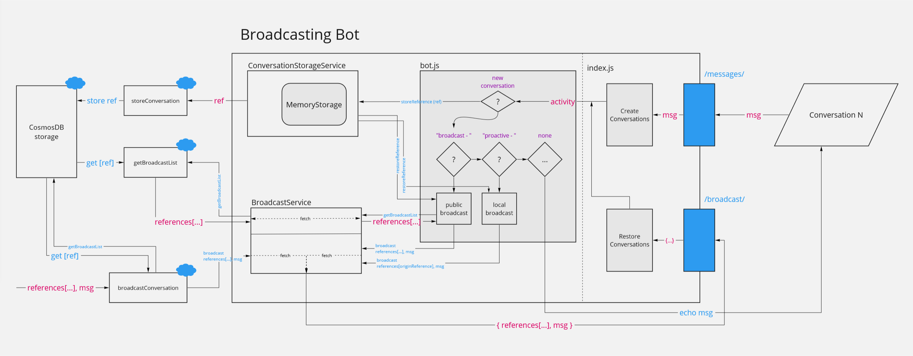

<a name="broadcasting"></a>
## Broadcasting bot Implementation

This sample continues the developments made in the advanced bot sample moving it further into broadcasting abstraction:
- Encapsulate core features into a set of separate classes (as local services)
- Add an option to broadcast to other users of the same bot
- Add a new Azure Function for broadcasting from an external source
- Instead of directly storying to CosmosDB we use an Azure Function as a  proxy

.

***The bot project inside the /node/broadcastingSample directory fully implements the following instructions.***

### Encapsulate the Conversation Reference Storage

1. Move all the processing of conversation references to a new separate class `ConversationInMemoryStorageService` (in the `./services/` folder).

This class implements three methods:
- `storeReference(turnContext)` - Extracts the conversation reference from context object and stores it in local memory.
- `restoreReference(turnContext)` - Restores the conversation reference for provided context object.
- `updateState(turnContext)` - Updates the conversation reference if there are any changes.

2. Next, in the `index.js` file create a new object of this class and pass it to the bot constructor:

```js
const conversationStorageService = new ConversationInMemoryStorageService();
const myBot = new MyBot(conversationStorageService);
```

3. Inside the `bot.js` file we can substiture all the direct calls to calling the methods of that service. E.g., while processing the `onTurn(turnContext)`:

```js
if (turnContext.activity.type === ActivityTypes.Message) {
    if (turnContext.activity.text.includes('proactive - ')) {
        ...
        const broadCastList = await this.getProactiveList(turnContext, message);
        ...
    } else {
        ...
    }
} else {
    ...
    if (turnContext.activity.membersAdded.length !== 0) {
        for (...) {
            if (...) {
                // store the conversation reference for the newly added user
                await this.conversationStorageService.storeReference(turnContext);
            }
        }
    }
}
await this.conversationStorageService.updateState(turnContext);
```

The `getProactiveList` method is defined as following:

```js
async getProactiveList(turnContext, message) {
    // pull the reference
    const originReference = await this.conversationStorageService.restoreReference(turnContext);
    const broadCastList = {
        references: [originReference],
        message
    };
    return broadCastList;
}
```

### Extend the Conversation Reference Storage to use External Storage

1. Next, extend the `ConversationInMemoryStorageService` class to allow storing refences in cloud (or probably any other external storage of your choice). To do that create a new class `ConversationAzureStorageService` extending the first one.

The constructor of `ConversationAzureStorageService` gets the url to an endpoint that will do the storing:

```js
class ConversationAzureStorageService extends ConversationInMemoryStorageService {
    constructor(storageServiceEndpoint) {
        super();
        this.storageServiceEndpoint = storageServiceEndpoint;
    }
    ...
}
```

This class redefines the `storeReference` method as following:

```js
    async storeReference(turnContext) {
        // pull the reference
        const reference = await this.restoreReference(turnContext);
        // store reference in memory using conversation data property
        await this.conversationReference.set(turnContext, reference);
        // store reference in external storage
        await fetch(this.storageServiceEndpoint, {
            method: 'POST',
            body: JSON.stringify({ reference }),
            headers: { 'Content-Type': 'application/json' }
        });
    }
```

2. Now, go back to the `index.js` redefine the `conversationStorageService` as following:

```js
// Init conversation storage service
const storageServiceEndpoint = process.env.storageEndpoint;
const conversationStorageService = new ConversationAzureStorageService(storageServiceEndpoint);
```

**Note**: Add `storageEndpoint` variable to your `.env` file, and to app settings on the Azure Portal. In our case it referes to external Azure Function like that: `https://<YOUAZUREFUNCTIONNAME>.azurewebsites.net/api/<METHOD>?code=<ACCESSCODE>`.

The Azure Function behind that endpoint is described in the [Azure Functions section](#azurefunctions).

### Add the Broadcast Endpoint

1. To broadcast the message to other conversations (or to the current one) rename the `/api/proactive` endpoint
to the `/api/broadcast` (just to highlight our intent) and add checking for the environment context:

```js
// Add broadcast endpoint
server.post('/api/broadcast', async (req, res) => {
    let references = req.body.references;
    let message = `**Broadcasted**: *${req.body.message}*`;
    console.log(`Beginning broadcast for ${references.length} references.`);

    await references.forEach(async (reference) => {
        // Ensure we are not calling localhost references when we are deployed to the cloud
        const localUrl = reference.serviceUrl.includes('localhost');
        const localEnv = BOT_CONFIGURATION === DEV_ENVIRONMENT;
        const matchEnv = (localEnv) || (!localEnv && !localUrl);
        if (matchEnv) {
            console.log(`Attempting restore conversation at ${reference.serviceUrl}`);
            try {
                // Try restore conversation
                await adapter.continueConversation(reference, async (turnContext) => {
                    await turnContext.sendActivity(message);
                });
            } catch (err) {
                // Catch unresponsive references
                console.log(`Unable to restore conversation at ${reference.serviceUrl}`);
                console.log(`Error message: ${e.toString()}.`);
            }
        }
    });
    res.send(200);
});
```

2. We also need to figure out the broadcasting endpoint depending on the current environment (in the `index.js`):

```js
const botBroadcastEndpoint = process.env.botBroadcastEndpoint;
const broadcastEndpoint = (BOT_CONFIGURATION === DEV_ENVIRONMENT) ? 'http://localhost:3978/api/broadcast' : botBroadcastEndpoint;
```

**Note**: Add the `botBroadcastEndpoint` variable to your `.env` file, and to the app settings on the Azure Portal. It should refer to the public bot enpoint like this one: `https://<YOUBOTNAME>.azurewebsites.net/api/broadcast`.

### Add the Broadcast Service

1. Define a new class `BroadcastService` that encapsulates the call to the endpoint defined in the previous section:

```js
class BroadcastService {
    constructor(botBroadcastEndpoint) {
        this.botBroadcastEndpoint = botBroadcastEndpoint;
    }

    async broadcast(broadCastList, broadcastEndpoint) {
        if (broadcastEndpoint === undefined) {
            broadcastEndpoint = this.botBroadcastEndpoint;
        }

        // send messages to all the referenced conversations
        await fetch(broadcastEndpoint, {
            method: 'POST',
            body: JSON.stringify(broadCastList),
            headers: { 'Content-Type': 'application/json' }
        });
    }
}
```

As of now the only purpose of this class is to pass the list of references and the message (defined in the `broadCastList` variable) to the specified endpoint.

2. In the `index.js` create an instance of `BroadcastService` and pass it to the bot constructor.

```js
const broadcastService = new BroadcastService(broadcastEndpoint);
const myBot = new MyBot(conversationStorageService, broadcastService);
```

3. Inside the `bot.js` we are now able to pass the broadcastList the that service to do actualy broadcasting:
```js
    if (turnContext.activity.text.includes('proactive - ')) {
        // if user types "proactive - {message}", send the message proactively
        const message = turnContext.activity.text.split('proactive - ')[1];
        const broadCastList = await this.getProactiveList(turnContext, message);
        await this.broadcastService.broadcast(broadCastList);
    }
```

So far when you type a "proactive - hello" message into the chat window, the bot will extract the "hello" message,
extract the conversation reference (that references to the same conversation) and send it back to you as a broadcased message.

No wide broacting is done yet.

### Extending the Broadcast Service for a Wide Broadcasting

1. Create a new class `BroadcastAzureService` that extends the `BroadcastService`. It will introduce
two new methods:
- `getBroadcastList(originReference, message)` - Fetches external endpoint to get the list of conversation references.
- `azureBroadcast(broadCastList)` - Reuses the `broadcast` method to use external broadcasting endpoint (added for demo purposes only).

```js
class BroadcastAzureService extends BroadcastService {
    ...
    async getBroadcastList(originReference, message) {
        const postBody = { originReference, message };

        // get broadcasting references
        const response = await fetch(this.broadcastListEnpoint, {
            method: 'POST',
            body: JSON.stringify(postBody),
            headers: { 'Content-Type': 'application/json' }
        });

        return await response.json();
    }
    ...
}
```

2. In the `index.js` substitute the `BroadcastService` with the new `BroadcastAzureService`:

```js
const broadcastService = new BroadcastAzureService(broadcastEndpoint, broadcastListEndpoint, azureBroadcastEndpoint);
const myBot = new MyBot(conversationStorageService, broadcastService);
```

The `broadcastListEndpoint` and `azureBroadcastEndpoint` consts are extracted from the environment variables,
and both reference to some Azure Functions.

3. In the `bot.js` add a new type of messages - `broadcast - <MSG>` that we can process:

```js
            ...
            if (turnContext.activity.text.includes('broadcast - ')) {
                // if user types "broadcast - {message}", send the message to everyone
                const message = turnContext.activity.text.split('broadcast - ')[1];
                const broadCastList = await this.getBroadcastList(turnContext, message);
                await this.broadcastService.broadcast(broadCastList);
            }
            ...
```

The `getBroadcastList` method is defined as following:

```js
...
    async getBroadcastList(turnContext, message) {
        // pull the reference
        const originReference = await this.conversationStorageService.restoreReference(turnContext);
        return await this.broadcastService.getBroadcastList(originReference, message);
    }
...

```

Now, if the Azure Functions are implemented, the bot should be able to broadcast messages to all the live conversations.

**Note**: so far we devined in the `.env` file and app settings on the Azure Portal the following variables:

```text
azureBroadcastEndpoint="https://<YOURAZUREFUNCTION>.azurewebsites.net/api/broadcastConversation?code=<ACCESSKEY1>"
broadcastListEndpoint="https://<YOURAZUREFUNCTION>.azurewebsites.net/api/getBroadcastList?code=<ACCESSKEY2>"
storageEndpoint="https://<YOURAZUREFUNCTION>.azurewebsites.net/api/storeConversation?code=<ACCESSKEY3>"
botBroadcastEndpoint="https://<YOUBOTNAME>.azurewebsites.net/api/broadcast"
botFilePath="./broadcastingbot.bot"
botFileSecret="<YOURBOTSECRET>"
```

<a name="azurefunctions"></a>
### Azure Functions

Now let's define our Azure Function. We are going to implement three functions (source code is available in the `broadcastSample\azureFunction` folder):
- `storeConversation` - stores conversation reference in a CosmosDB database
- `getBroadcastList` - extracts all conversation references from the CosmosDB database
- `broadcastConversation` - send the message to provided conversation references (or all the references from CosmosDB)

1. Setup your CosmosDB database and add a new collection (e.g., `Conversations`). 

2. For the `storeConversations` and `getBroadcastList` functions define either `out` or `in` directioned binding to that database (can be done visually through the portal or in-code inside the `function.json` file.). Usually it looks like the following structure:

```js
{
  ...
  "bindings": [
    ...
    {
      "name": "<VARIABLE_NAME_TO_USE_IN_FUNCTION",
      "type": "cosmosDB",
      "direction": "<DIRECTION:IN_OR_OUT>", 
      "databaseName": "YOUR_DATABASE",
      "collectionName": "YOUR_COLLECTION",
      "connectionStringSetting": "<CONNECTION_STRING>"
    },
  ]
}

```

**Note** You should also define in-bounding `httpTrigger` and out-bounding `http` integration bindings for all functions.


3. The `storeConversations` function is defined as following:

```js
module.exports = async function(context, req) {
    context.log("Storing conversation reference.")

    if (req.query.reference || (req.body && req.body.reference)) {
        const conversationReference = req.query.reference || req.body.reference;
        context.res = {
            status: 200
        };
        context.bindings.outputConversation = conversationReference;
    } else {
        context.res = {
            status: 400,
            body: 'Please pass a reference on the query string or in the request body'
        };
    }
    context.done();
};
```

In this function we use `out`-binding, so anything stored in the `outputConversation` property will be passed to the CosmosDB database defined through the bindings.

4. The `getBroadcastList` function is defined as following:

```js
module.exports = async function (context, req) {
    context.log('Collecting broadcasting list.');
    const message = req.body.message;
    const originReference = req.body.reference;
    const list = context.bindings.conversationsList;
    
    if (list.length > 0) {
        const references = context.bindings.conversationsList;  

        context.res = {
            status: 200,
            body: JSON.stringify({
                references,
                message,
            })
        };
        context.log(`Returned ${list.length} references`);
    }
    else {
        context.res = {
            status: 400,
            body: "No active references found."
        };
        context.log(`No active references found.`);
    }
};
```

In this function we use the in-binding for the database. If required, you can also specify the request through the `sqlQuery` property in the binding definition. E.g., you might like to filter out the `originReference` for the response.

5. And the `broadcastConversation` function is defined as following:

```js
const fetch = require('isomorphic-fetch');

module.exports = async function (context, req) {
    context.log('Broadcasting the message!');

    const message = req.body.message;
    const references = req.body.references;
    let broadcastList = {
        message
    };
    const broadcastListEnpoint = process.env.broadcastListEnpoint;
    // build broadcasting list if nothing is provided
    if (references === null || references === undefined || references.length === 0) {
        context.log(`No references to broadcast provided. Extracting references from the endpoint.`);
        const postBody = { originReference: null, message };

        const response = await fetch(broadcastListEnpoint, {
            method: 'POST',
            body: JSON.stringify(postBody),
            headers: { 'Content-Type': 'application/json' }
        });
        broadcastList = await response.json();
    }

    const botBroadcastEndpoint = process.env.botBroadcastEndpoint;
    await fetch(botBroadcastEndpoint, {
        method: 'POST',
        body: JSON.stringify(broadcastList),
        headers: { 'Content-Type': 'application/json' }
    });
    context.res = {
        status: 200
    };
    context.log(`Broadcasted to ${broadcastList.references.length} conversations.`);
    context.done();
};
```

This function mimics our implementation in the `broadcastAzureService` class. If request containd some references, the function will use them, if not--it will fetch to the `getBroadcastList` function (defined via the `broadcastListEnpoint` endpoint).

The `broadcastConversation` function allow implement broadcasting originated outside of the bot.

### External Broadcasting

To make an externally originated broadcast you just need to pass some message to the `broadcastConversation` function. For example, you might use Logic App to setup a timed trigger like the following one:

.